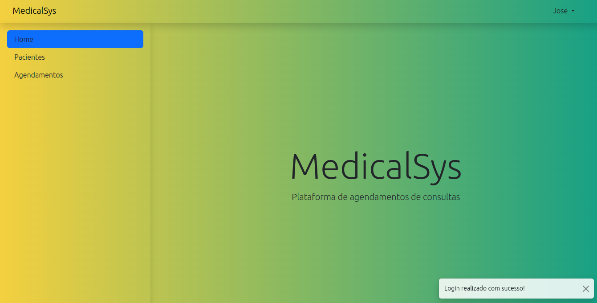
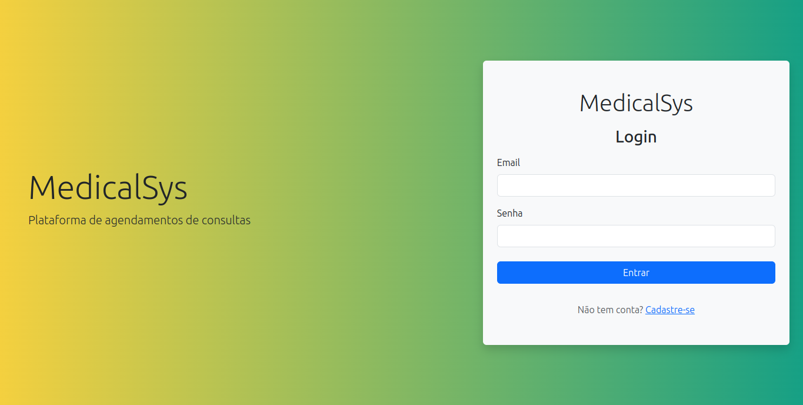
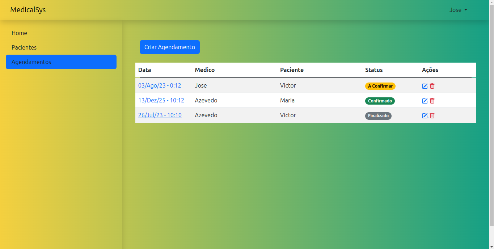

# MedicalSys

Protótipo de uma aplicação de agendamento de consultas médicas.



## Funcionalidades

- Cadastro de usuário médicos;
- CRUD Pacientes;
- CRUD Agendamentos;

## Deploy

Você pode ter acesso ao deploy [aqui](https://desafio-medicalsys-production.up.railway.app/).

## Como executar

### Opção Local:

#### Requisitos

- Ter o Python instalado em sua máquina. (Versão recomendado: 3.11.2);
- virtualenv (Versão recomendado: 20.19.0);
  
1. Clone este repositório;

```bash
git clone git@github.com:victor-azevedo/desafio-medicalsys.git

cd desafio-medicalsys
```

2. Criar, ativar ambiente virtual e instalar as dependências:

```bash
virtualenv venv

source venv/bin/activate

pip install -r requirements.txt
```

4. Entrar na aplicação e realizar as migrações e rodar a aplicação:

```bash
cd medicalsys/

python manage.py migrate
```

5. Rodar a aplicação:

```bash
python manage.py runserver
```

A aplicação vai rodar na porta: http://127.0.0.1:8000


### Opção com Docker:

#### Requisitos

- Ter Docker Compose instalado.
  
1. Clone este repositório;

```bash
git clone git@github.com:victor-azevedo/desafio-medicalsys.git

cd desafio-medicalsys
```

2. Rodar container Docker:

```bash
docker compose up
```

A aplicação vai rodar na porta: http://0.0.0.0:8000

## Exemplos




